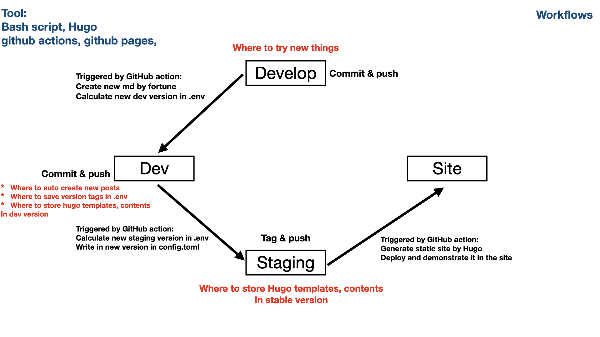
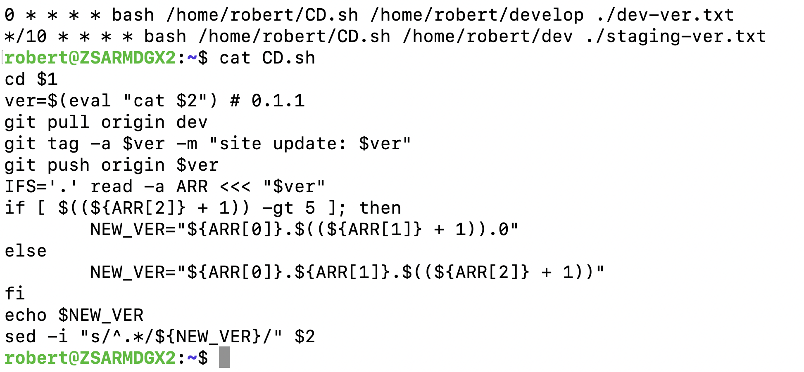

+++
author = "Robert Chu"
title = "Thoughts of this site"
date = "2021-05-20"
description = "Some thoughts and reasons of this site"
tags = [
    "devops",
    "sre",
    "reasons",
    "thoughts",
]
categories = [
    "devops",
    "sre",
]
+++

# Robert Chu - Devops Task
### static site generator chosen
#### Why Hugo, not Jekyll
- more straightforward (installing themes and itself)
- binary (easier) installation
- faster builds
- Go built
- built-in live reload server
- Useful Features (e.g. Menus, sitemaps)
- Thriving community (The most Github stars in all static site generator)

#### Why [Erblog](https://themes.gohugo.io/erblog/) as theme
- mobile responsive
- posts showed in the landing pages

### Why only github actions, github pages used
- simple and clean system with less tools
- functions strong and documents solid

### Workflows as below

#### branchs working rules
- develop
    - try anything here and pushed to remote for deploying to dev branch
- dev (*/10 * * * *)
    - create new md thru fortune to /content/post
    - calculate new version thru **dev_version in .env** by the rule of dev
    - tag and push to staging branch to trigger github actions in it
- staging (0 * * * *)
    - any pushed tags here would update to [the site](https://robertchu1205.github.io/) as prd
    - repo based from the latest dev
    - calculate new version thru **pushed tag** or **staging_version in .env** by the rule of staging
    - new staging version would be showed in the footer of the site

### troubleshooting
1. schedule in github action (detail showed below)
    - too slow to use it in CD; use jenkins, cronhub or physical servers instead
1. trigger continously if related
    - seperated yml files restricted by some specific branches only, like main or master
1. schedule in github action
    - too slow to use it in CD; use jenkins, cronhub or physical servers instead
1. sites redirect incorrectly
    - url becoms directory if uglyURLs is true; not found if relativeURLs is false

